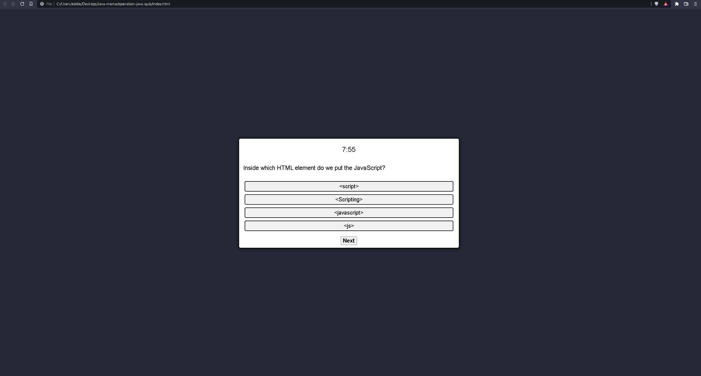
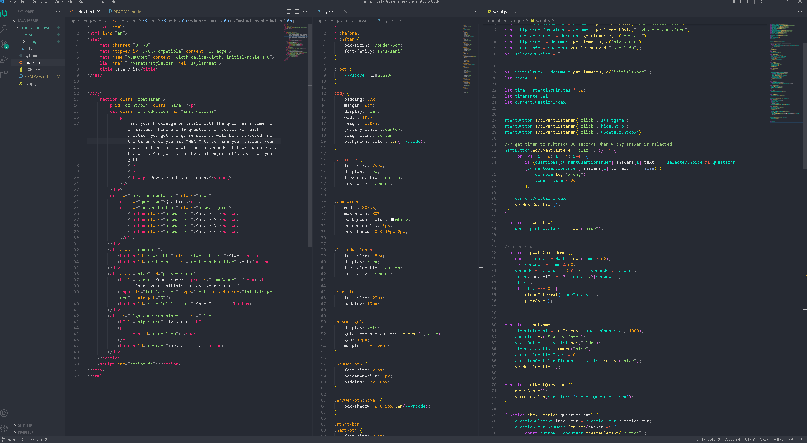

# operation-java-quiz
A quiz designed to test your knowledge on javascript

## Description
This webpage is meant as an interactive challenge. If you are struggeling with understanding certain JavaScript elements, this quiz will help test your knowledge. The motivation for this webpage was to test a users knowledge, while making the quiz fun and challenging. The challenge come with the timer counting down to zero. On top of the timer, every incorect answer that the users selects, 30 seconds will be subtracted from the total time left. This creates a sense of urgency and a challenge to finish the test better than other users. 

## Installation 
* Open the index.html file in a new window to see web application.
* Open deployed link below in a new window to see web application.

## Preview

## Deployed Link
[Deployed Webpage](https://eddiefigueroa18.github.io/operation-java-quiz/)

## Credits 
Eduardo Figueroa

[Git Profile](https://github.com/eddiefigueroa18/operation-java-quiz)

